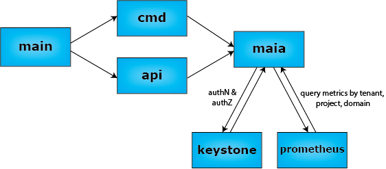

# Maia

[](https://travis-ci.org/sapcc/maia)
[](https://coveralls.io/github/sapcc/maia?branch=master)
[](https://goreportcard.com/report/github.com/sapcc/maia)
[](https://godoc.org/github.com/sapcc/maia)

Maia is an OpenStack-compatible service that allows querying Prometheus metrics per OpenStack project or domain.
It was originally designed for the SAP Converged Cloud.

# Design



# Installation

Via Makefile

* `make` to compile and run the binaries from the `build/` directory
* `make && make install` to install to `/usr`
* `make && make install PREFIX=/some/path` to install to `/some/path`
* `make docker` to build the Docker image (set image name and tag with the `DOCKER_IMAGE` and `DOCKER_TAG` variables)


# Using Maia

Maia can be used with an unmodified Prometheus. You can download Prometheus from its [website](https://prometheus.io/download/).
To configure Prometheus to receive data from Maia, the following job configuration has to be applied.
In the `basic_auth` section a valid user id, project id and password, corresponding to your OpenStack User and Project, has to be provided.
Moreover the user is required to have the `metric-list` role.

```yaml
scrape_configs:

  # The job name is added as a label `job=<job_name>` to any timeseries scraped from this config.
  - job_name: 'maia'
    metrics_path: "/v1/metrics"
    basic_auth:
      # Corresponds to your OpenStack User and Project
      username: <user_id>@<project_id>
      password: <password>

    static_configs:
      - targets: ['maia.<region>.cloud.sap:8789']
  
```

Prometheus' targets page ( Status -> Targets ) should the new job and the endpoint with `State UP`. 
The `Error` column should be empty. 
It might indicate a failed authorization ( `401 Unauthorized`) or that no metrics where found for the given scope (`404`), in which cases you might want to verify the credentials and role assignments.
